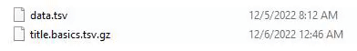
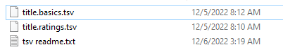

# Movieholics

Movieholics is a command-line application built with C++ that recommends different movies depending on a set of parameters. 
The program takes data from the imdb movie database https://datasets.imdbws.com/ and uses the uses parameters on movie genre,
rating popularity, and length to give each movie a weight. Once weighted, the movies are sorted by score with both quick sort and merge sort and
then displayed. The time for each sorting algorithim is also dispalyed.

## Table of Contents

- [Prerequisites](#Prerequisites)

- [Installation](#Installation)


## Prerequisites

(NOTE: All prerequisite instructions are for windows only)

- MinGW or some other form of C++ devlopment envrionment
    * Download here: https://sourceforge.net/projects/mingw/
    * add MinGW path to PATH variable

- Make (MinGW's make is recommended)
    - To install mingw make run ```mingw-get install mingw32-make```
## Installation

- Open a command line and enter the root directory of the repo

- Run ```make``` or ```mingw32-make``` depending on your make installation
    - This command compiles ```main.cpp``` and ```Movie.cpp``` into the main executable titled ```Movieholics.exe```

- Run the Movieholics.exe using ```./Movieholics.exe```
## Updating the Dataset

Updating the dataset with the latest data from imdb takes a little more effort

- Updating prerequisites
    - Python 3
        - Download here https://www.python.org/downloads/
        - Make sure pip is installed as well https://pip.pypa.io/en/stable/installation/
    - Pandas (Python Library)
        - To install, run ```pip install pandas```
        - More information at https://pandas.pydata.org/

- Tutorial

    - Download ```title.basics.tsv.gz``` and ```title.ratings.tsv.gz``` from https://datasets.imdbws.com/
        - Note: you might need a different extraction program like [7-zip](https://www.7-zip.org/) to extract
            the files properly
        - Once extraced, make sure to rename each ```data.tsv``` file to ```"foldername.tsv"```
        - Example:
        
        

    - Place renamed .tsv files into the ```/Data/``` folder within the root directory
        - Your final ```/Data/``` folder should look like this:

        

    - Open a command line and enter the root directory of the repo

    - Run ```python DataEngineering.py```
        - This script changes the tsv file to csv for easy data parsing
            as well as removes adult/unrated movies from the database
        - When finished, a new file should be generated in the ```/Data/``` folder titled ```merged_data.csv```
